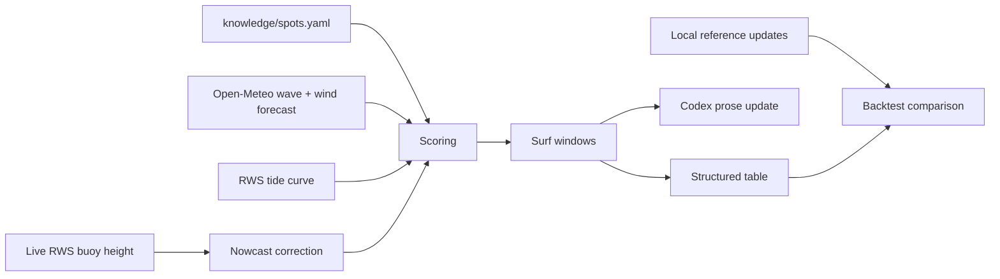

# surfwa

Personal surf forecast CLI for the Dutch coast.

`surfwa` turns wave, wind, tide, live wind, and a hand-maintained spot rule base into a short surf update. It is built for quick personal decisions: where is worth checking, when is the window, what board makes sense, and what local warnings matter.

## What It Does

- Fetches wave and wind forecasts from Open-Meteo.
- Fetches tide data from Rijkswaterstaat DD-API 2.0.
- Fetches current coastal wind from Buienradar.
- Scores surf windows for Zuid-Holland and Noord-Holland spots.
- Applies live buoy nowcast correction when available.
- Renders either a structured table or a Dutch prose update through `codex exec`.
- Optionally renders a forecast chart PNG: wave height, wind arrows, tide curve, and surf window bars per day.
- Replays historical dates against local reference files for backtesting.

## Method

The model is deliberately simple and inspectable. It does not try to be a black-box surf oracle.



Each spot has a small rule profile in `knowledge/spots.yaml`:

- beach orientation
- tide station
- wave buoy
- tide preference
- minimum wave height and period
- swell-sector quirks
- local notes and warnings

For each forecast hour, surfwa scores:

- **swell quality**: height, period, and whether the direction reaches the spot
- **wind quality**: offshore, cross-shore, onshore, and wind strength
- **tide factor**: spot-specific tide preference
- **local warnings**: current, kiters, shorebreak, or other spot notes

Adjacent surfable hours become a surf window. Those windows are rendered directly as a table or passed to `codex exec` for a compact Dutch surf update. The default prose prompt uses a fixed style guide and the current forecast JSON only; it does not include local example texts.

## Install

Requires [uv](https://docs.astral.sh/uv/) and Python ≥ 3.12. No API keys needed — all data sources are free and keyless.

```bash
uv sync
```

## Usage

Structured output, no LLM:

```bash
uv run surfwa update --days 2 --no-llm
```

Prose output via `codex exec` (requires the `codex` CLI on your PATH; falls back to the structured table without it):

```bash
uv run surfwa update --days 2
```

One spot only:

```bash
uv run surfwa update --days 2 --no-llm --spot ijmuiden
```

Forecast chart PNG (requires the `image` extra: `uv sync --extra image`; defaults to `surfwa-YYYY-MM-DD.png`):

```bash
uv run surfwa update --days 2 --no-llm --image
uv run surfwa update --image pad/naar/grafiek.png
```

Static daily page (digest + chart, written to `site/index.html`):

```bash
uv run surfwa web --days 3 --out site
```

A scheduled GitHub Action (`.github/workflows/pages.yml`) runs this every
morning and publishes the result to GitHub Pages.

Historical backtest:

```bash
uv run surfwa backtest --date 2026-07-03 --update knowledge/updates/my-notes-2026-07-02.md
```

## Example Structured Output

```text
surfwa update
========================================
Actuele wind: Hoek van Holland WZW 5bft, IJmuiden ZW 4bft

## Tuesday 07 July
  Scheveningen                      0-4u  score  6.3  0.9m @ 4.6s  W 2bft  afgaand  [shortboard]
                               ! Noord-spot: stroming brengt je snel de zee op
  Ter Heijde / Kijkduin / Monster      0-5u  score  6.0  0.8m @ 4.6s  WNW 2bft  laagwater  [fish/longboard]
                               ! Beetje stroming bij cleane avondsessies
  Petten (tot Juliana)             20-0u  score  4.5  1.4m @ 5.6s  NNW 3bft  afgaand  [shortboard]
```

The structured view is the instrument panel. It is best for debugging, tuning, and backtesting because every call includes the exact score, window, wave height, period, wind, tide phase, board advice, and warning.

## Example Prose Output

```text
Dinsdag vroeg vooral Z-H: Schev 00-04u met 0.9m @ 4.6s, W 2bft en shortboard.
Ter Heijde/Kijkduin 00-05u iets cleaner voor fish/longboard. Later op de dag
wordt N-H noord groter maar windgevoeliger: Petten 20-00u rond 1.4m @ 5.6s.
Mvlakte alleen marginaal en met stromingswaarschuwing.
```

The prose path is better for daily use. It groups spots and makes the update readable. The structured path is better when you want to understand or improve the model.

## Backtesting

Reference updates — your own notes on how past days actually went — live in the untracked `knowledge/updates/` directory. A backtest runs surfwa for a historical date and prints the generated windows next to the reference:

```bash
uv run surfwa backtest --date 2026-07-05 --update knowledge/updates/my-notes-2026-07-04.md
```

Backtesting is currently a human-assisted comparison. The next improvement should be a golden evaluator:

1. Label 8-10 reference days with expected spots, windows, and priorities.
2. Run surfwa against those dates.
3. Score hits, misses, wrong-time calls, and overcalls.
4. Tune ranking and spot rules against the whole scorecard instead of one day at a time.

That matters because surfwa currently tends to be exhaustive: if a spot crosses threshold, it lists it. Good forecasting is more editorial: rank the best options, suppress noise, and call out local judgement.

## Project Layout

```text
knowledge/spots.yaml          spot rule base
knowledge/updates/            local reference updates (untracked)
src/surfwa/fetch/             Open-Meteo, RWS, Buienradar clients
src/surfwa/score.py           hourly scoring and window detection
src/surfwa/pipeline.py        fetch -> nowcast -> score pipeline
src/surfwa/render/            structured and prose renderers
src/surfwa/backtest.py        historical replay
tests/                        unit tests
```

## Testing

```bash
uv run --extra dev pytest -q
```

## Privacy Notes

Everything under `knowledge/updates/` is personal local material and stays untracked. The default prose path uses local `codex exec` with a compact fixed style guide and the current forecast JSON only. Use `--no-llm` when you want a fully deterministic local output path without prose generation.

## Status

This is a working personal CLI, not a finished forecasting product. The current model is useful for surf checks, but the next meaningful upgrade is evaluation and ranking: build the golden scorecard first, then tune the rules.
